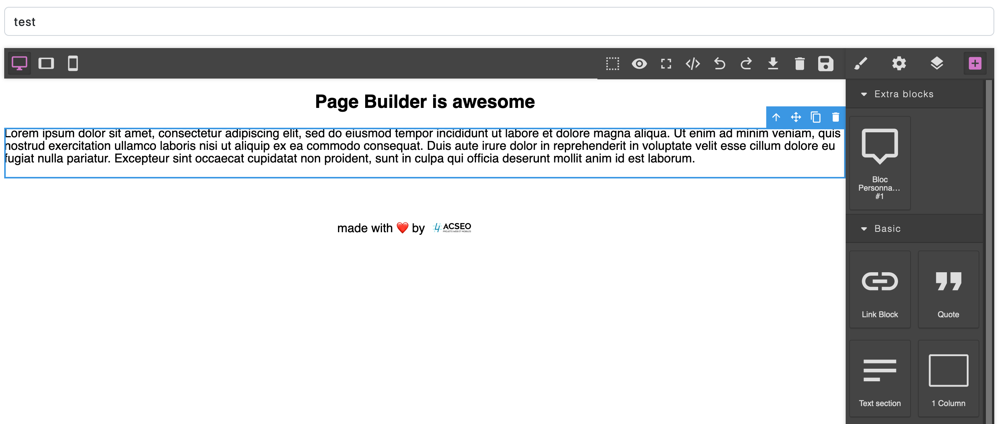

# ACSEO PageBuilder Bundle

This bundle provides a PageBuilder Solution built on top of [GrapesJS](https://grapesjs.com/). it provides :

* a **Twig Component** that you can use in your template with `{{ component('PageBuilder' {'idField' : 'my_field'}) }}`. This component will create the PageBuilder area.
* a `Page` Entity and a `PageController` that will allow you to store and load the HTML, CSS, and JSON config of the generated Web page.
* a **Twig Component** that you can use to render the page and handle dynamic block rendering `{{ component('PageRender', {'html' : page.html}) }}`

## Installation

### Install the bundle using composer

```bash
composer require acseo/pagebuilder-bundle
````

Enable the bundle in you Symfony project

```php

<?php
// config/bundles.php

return [
    ACSEO\PageBuilderBundle\PageBuilderBundle::class => ['all' => true],
```

### Enable PageController to Load / Save Pages

You can choose to use the default `PageController` provided in order to load / save the Page entities

To do so, you need to enable the route in your project : 

```yaml
# config/routes/acseo_page_builder.yaml
acseo_page_builder:
    resource: '@PageBuilderBundle/src/Controller/'
    type: attribute
```

### Update your database to create the Page Entity

With doctrine, according to your strategy :

```bash
php bin/console doctrine:schema:update
# OR
php bin/console doctrine:migrations:diff
```

# Configuration

The Bundle configuration allows you to manage how GrapesJS will be **loaded**, and what additionnal **plugins** or **blocks** will be added

Here is an example of a configuration file :

```yaml
# config/packages/acseo_page_builder.yaml
acseo_page_builder:
  #
  # GrapesJS Config
  #
  # Use this to have only default values
  #
  grapesjs: ~  
  #
  # Use this to set specific values
  #
  grapesjs:
    js:             # Optional : URL of the JS file for GrapeJS. 
                    # Default : https://cdnjs.cloudflare.com/ajax/libs/grapesjs/0.21.7/grapes.min.js
    css:            # Optional : URL of the CSS file for GrapeJS. 
                    # Default : https://cdnjs.cloudflare.com/ajax/libs/grapesjs/0.21.7/css/grapes.min.css
    urlLoad:        # Optional : Route name used to load Page JSON Content. 
                    # Default : acseo_page_builder_load
    urlStore:       # Optional : Route name used to store Page JSON Content. 
                    # Default : acseo_page_builder_save
    pageController: # Optional : Controller used to load / save Pages.       
                    # Default : PageController::class 
  #
  # Plugins Config
  # Array of name, url, options
  #
  plugins:
    ## Uncomment this example to load grapesjs-preset-webpage
    #- name: grapesjs-preset-webpage
    #  url: https://cdn.jsdelivr.net/npm/grapesjs-preset-webpage@1.0.3/dist/index.js                  
  #
  # Blocks Config
  # Declare your custom Blocks
  #
  blocks:
blocks:
      latest-articles:
        label: 'Latest articles'
        category: 'Extra blocks'
        media: '<svg viewBox="0 0 24 24"></svg>'
        content:
          attributes:
            'render': 'latest_articles'
          traits:
            - label: 'Number of articles'
              name: 'articles'
              type: 'text'
              value: '5'
            - label: 'Number of columns'
              name: 'columns'
              type: 'text'
              value: '2'
          content: '<div class="block">Latest articles. This block will be replaced by latest articles</div>'
```

## Dynamic block rendering

You can create a custom block that will allow you, like the Twig extension method `{{ render() }}`, to make a call to a Controller inside your page.

To do so, your block must contain an attribute `render = 'route_name'`. All the attributes of this block will be sent as arguments to the Controller.

The generated output of this fragment will replace the original content of the page.

In our previous example, the custom block `latest-articles` will generate the following HTML :

Stored HTML in Page Entity : 

```html
<!-- ... -->
<p>Lorem Ipsum</p>
<div id="ijf8l" render="latest_articles" columns="1" articles="3">
  <div class="block">
    Latest articles. This block will be replaced by latest articles
  </div>
</div>
<p>Lorem Ipsum</p>
<!-- ... -->
```

Generated HTML with `{{ component('PageRender', {'html' : page.html}) }}`

```html
<!-- ... -->
<p>Lorem Ipsum</p>
<!-- result from the route latest_articles -->
<ul>
  <li>Article 1</li>
  <li>Article 2</li>
  <li>Article 3</li>
</ul>
<p>Lorem Ipsum</p>
<!-- ... -->
```

# Usage

In order to work, your Twig page **must** contain an input field with the *page identifier* (the URI).

```twig
{# templates/my/page.html.twig #}

<input type="hidden" id="page_uri" value="hello-world" />
{# OR #}
<input type="text" id="page_uri" />

{{ component('PageBuilder', {'idField' : 'page_uri'}) }}
```

# Result

If everything goes well, you should have a screen like this :


